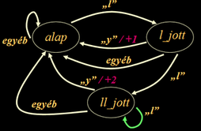

# Állapotgép 2.0
Szorgalmi feladat __Karsa Zoltán__tól (extra pont: 4)

Ahogyan az első félévben tanultuk, az állapotgépek (véges automaták) kézenfekvő megvalósítása a [táblázatos megvalósítás](https://infoc.eet.bme.hu/ea12/#13), melynek lényege, hogy a pillanatnyi állapottól és az aktuális inputtól függően elővesszük egy táblázatból az új állapotot és az állapotátmenethez tartozó tevékenységet megvalósító függvény címét, amit végrehajtunk. Ezzel állapotgépünk algoritmusa így nézhet ki:
```
while (van_input) {
    új_állapot = állapot_tábla[akt_állapot][input]
	tevékenység = tevékenység_tábla[akt_állapot][input]
	tevékenység_végrehajtása
	akt_állapot = új_állapot
}
```
Így egy konkrét feladat (pl. ly-számláló) implementálása csak a két táblázat megfelelő kitöltéséből áll, feltételezve, hogy mind az állapotokat, mind az inputot olyan módon kódoljuk, hogy azzal az adott nyelven lehet táblázatot (tárolót) indexelni. C nyelven integrális típussal lehet indexelni. C++-ban már más a helyzet (ld. asszociatív tárolók). 
A táblázatok (lehet összevont táblázat is) kitöltését segítheti valamilyen generátor, ekkor azok mérete nem nagyon érdekes. Amennyiben kézzel töltjük ki, érdemes a táblázat méretét csökkenteni. A legkézenfekvőbb csökkentési lehetőség az állapotok összevonása és az inputok csoportokra bontása (ld. ly-számláló példa).

Az alábbiakban bemutatjuk a fenti, táblázatos módszer egy általánosított megvalósítását C++-ban. A feladat ennek megértése és felhasználásával két további állapotgéppel leírható probléma megoldása.

## Állapotgép ősosztály

Az újrafelhasználáshoz készítettünk egy `Allapotgep` ősosztályt (_allapotgep.hpp_), amely a következő sablonparaméterekkel rendelkezik:
```c++
template <
    typename All, //az állapotokat kódoló típus
    typename Inp, //az inputcsoportokat kódoló típus 
    typename T    //az input típusa
>
class Allapotgep {
    //...
};
```

Az állapotgép a genetika szorgalmihoz viszonyítva a template paraméterezés mellett az alábbiakban tér el:

 - tárolja a bevezetőben említett táblázatban a következő állapotot és az akciót;
 - minden állapotátmenetkor végrehajt egy akciót.
 
A következő állapot és az akció tárolására heterogén kollekcióként tárolt objektumokat használunk, melyek alaposztálya a `Nop` osztály. Ez az osztály nem csinál semmit az _akcio_ során, csak eltárolja a következő állapotot. 

```c++
struct Nop {
    /// következő állapot
    All kov_allapot;
    Nop(All kov_all) : kov_allapot(kov_all) {}
    /// ha az állapotgép ebbe az állapotba ér, meghívja ezt a függvényt
    /// @param ch - erre az input értékre léptünk ide
    virtual void akcio(T ch) {}
    virtual ~Nop() {}
}; //allapotgep.hpp
```

A 2D táblázathoz egy olyan osztályt definiáltunk, amely az All és Imp sablonparaméterként megadott típusokkal indexelhető, és törli a tárolt elemeket, ha elérkezett az idő.
```c++
struct AllTabla : public std::map<All, std::map<Inp, Nop*> > {
    ~AllTabla() {  // bejárjuk a tárolót és töröljük a dinamikusan létrehozott elemeket 
        typename AllTabla::iterator i1 = this->begin();
        while (i1 != this->end()) {
            typename std::map<Inp, Nop*>::iterator i2 = i1->second.begin();
            while (i2 != i1->second.end()) {
                delete i2->second;
                ++i2;
            }
            ++i1;
        }
    }
}; //allapotgep.hpp
```
Az `Allapotgep` osztály továbbá a következő függvényekkel rendelkezik:
```c++
/// beállítja a kezdő állapotot és az állapottábla referenciáját
Allapotgep(All kezdo, AllTabla& tab) : akt_allapot(kezdo), tab(tab) {}
/// az input átalakítását végző segédfüggvény
/// @param ch a kapott input
/// @return az inputnak megfelelő Inp-ben kódolt érték
virtual Inp input(T ch) const = 0;
/// Input feldolgozása
/// @param ch aktuális input
/// @return az átmenet után melyik állapotba értünk
All operator()(T ch) {
    Inp akt_input = input(ch);
    tab[akt_allapot][akt_input]->akcio(ch);
    akt_allapot = tab[akt_allapot][akt_input]->kov_allapot;
    return akt_allapot;
} //allapotgep.hpp
```
Nézd meg az osztályt tartalmazó _allapotgep.hpp_ fejlécfájlt!

## Lyszamlalo
Az állapotgép használatát az első félévben már megismert feladattal mutatom be: [Számoljuk egy szövegben az ly-ok számát!](https://infoc.eet.bme.hu/ea12/#6) 
Emlékeztetőül az állapotgráf: 

  

Az állapotgép *char* bemenetet kap. Az állapotok kódolására az LyAllapot típust, az inputcsoportok kódolására pedig az LyInput típust vettem fel. Az számláláshoz pedig felvettem egy int számlálót (sz). 

```c++
//https://en.cppreference.com/w/cpp/language/enum#Scoped_enumerations
enum class LyAllapot { alap, l_jott, ll_jott};
enum class LyInput   { l, y, egyeb };
class Lyszaml : public Allapotgep<LyAllapot, LyInput, char> {
    Allapotgep::AllTabla tab;
    int sz = 0;
    //...
}; //lyszamlalo.hpp
```
_Megjegyzés: a template paraméterek miatt nyugodtan használhattunk volna az enum-ok vagy akár a char helyett egy szimpla osztályt is. Így akár komplikáltabb logika is beépíthető._

Az egyes állapotokhoz kapcsolódó akciókat a következő módon definiáljuk: 

```c++
struct Novel1 : public Nop {
    Lyszaml& allapotgep;   // állapotgép referenciája, hogy elérje a számlálót
    Novel1(LyAllapot all, Lyszaml& allapotgep) : Nop(all), allapotgep(allapotgep) {}
    void akcio(char ch) { allapotgep.sz += 1; }
};
struct Novel2 : public Nop {
    Lyszaml& allapotgep;
    Novel2(LyAllapot all, Lyszaml& allapotgep) : Nop(all), allapotgep(allapotgep) {}
    void akcio(char ch) { allapotgep.sz += 2; }
}; //lyszamlalo.hpp
```

Az állapotgép tábláját az átláthatóság kedvéért soronként adtam meg inicializáló lista segítségével: 
```c++
Lyszaml::Lyszaml() : Allapotgep(LyAllapot::alap, tab), sz(0) {
    tab[LyAllapot::alap] =   {{LyInput::l, new Nop(LyAllapot::l_jott)},
                              {LyInput::y, new Nop(LyAllapot::alap)},
                              {LyInput::egyeb, new Nop(LyAllapot::alap)}};
    tab[LyAllapot::l_jott] = {{LyInput::l, new Nop(LyAllapot::ll_jott)},
                              {LyInput::y, new Novel1(LyAllapot::alap, *this)},
                              {LyInput::egyeb, new Nop(LyAllapot::alap)}};
    tab[LyAllapot::ll_jott]= {{LyInput::l, new Nop(LyAllapot::ll_jott)},
                              {LyInput::y, new Novel2(LyAllapot::alap, *this)},
                              {LyInput::egyeb, new Nop(LyAllapot::alap)}};
} //lyszamlalo.cpp
```

A bemenetet inputcsoportokká alakító függvény `Lyszamlalo` esetén. Magyarázatra nem szorul:
```c++
LyInput input(char ch) const {
    if (ch == 'l') return LyInput::l;
    if (ch == 'y') return LyInput::y;
    return LyInput::egyeb;
} //lyszamlalo.hpp
```

_Megjegyzés: használhattunk volna enum helyett olyan osztályt, amely az érkezett karaktertől függően úgy viselkedik, mint az _LyInput_

Az `Lyszamlalo` **get()** függvénye visszaadja a megtalált _ly_-ok számát. Továbbá bevezettünk egy segéd **str()** függvény is. Nézd meg a **runtests** statikus függvényhez tartozó teszteseteket!

## Feladatok
### Kommentezés
A mintapélda alapján hozz létre egy `Komment` osztályt, amely a bemenetére érkező szabályos C programból kiszűri a /* ... */ alakú kommenteket! Feltételezzük, hogy szövegkonstansban nem szerepel "/\*", ill. "\*/" karaktersorozat. A megszűrt, komment nélküli programot az osztály **std::string get()** tagfüggvényével lehet lekérdezni. 

Nézd meg a _main.cpp_-ben lévő teszteket, állítsd az _ELKESZULT_ makrót 1-re, és próbáld megoldani a feladatot. A megoldás során a *komment.hpp* és *komment.cpp* fájlokban dolgozz!

### Split
Hozz létre egy `Split` osztályt, amely a bemenetére érkező karaktereket úgy dolgozza fel, hogy a konstruktorában megadott **határoló karakter** mentén a szöveget feldarabolja, és **get()** függvénye egy `std::vector<std::string>` példányban adja vissza a szétválasztott elemeket! 
A bemenet elején/végén érkező határoló karaktereket figyelmen kívül hagyjuk. Amennyiben több határoló karakter érkezik egymás után, azt egy karakternek tekintjük, azaz nem keletkezik üres sztring a feldolgozás során.  

Nézd meg a _main.cpp_-ben lévő teszteket, állítsd az _ELKESZULT_ makrót 2-re, és próbáld megoldani a feladatot. A megoldás során a *split.hpp* és *split.cpp* fájlokban dolgozz!

## Megoldás
A Git tárolóból letölthető [https://git.ik.bme.hu/Prog2/szorgalmi_feladatok/Allapotgep_2.0](https://git.ik.bme.hu/Prog2/szorgalmi_feladatok/Allapotgep_2.0)
fájlok felhasználásával hozz létre a lokális fejlesztőkörnyezetedben egy C++ projektet! Ehhez felhasználható a *Makefile*, amiben megtalálhatók a fordítási opciók. Tervezz, fejlessz, tesztelj, majd töltsd fel a megoldást a Jporta rendszerbe! 

## Beadás
Beadandó a *komment.hpp*, *komment.cpp*, *split.hpp* és *split.cpp* fájlok. 
